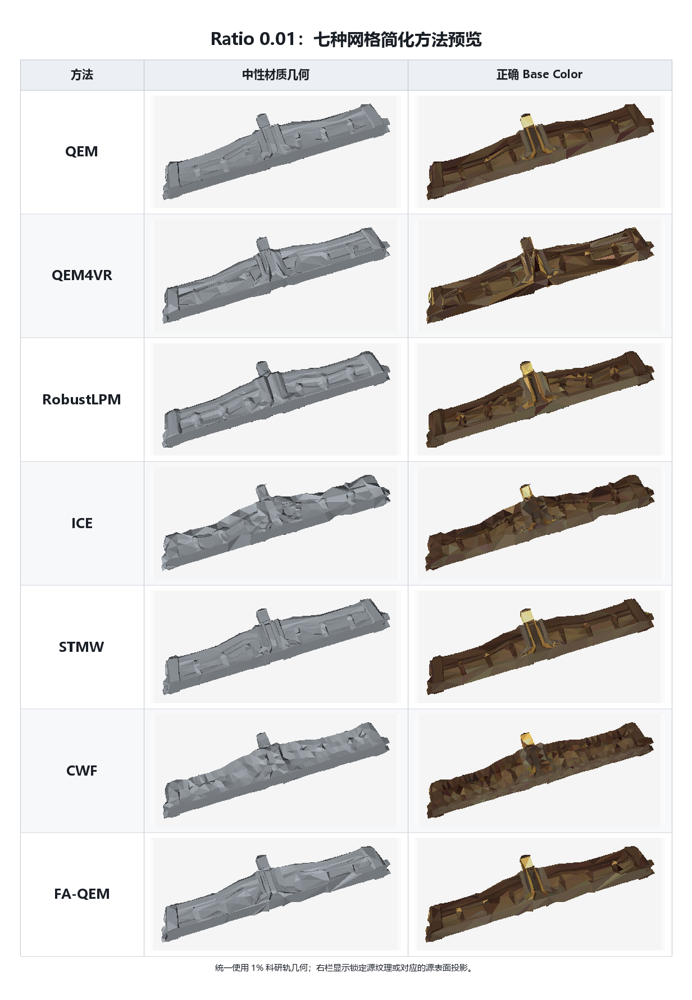

# Ratio 0.01：七种网格简化方法汇总

## 关键指标

| 方法 | 科研轨状态 | 实际面数 | 目标偏差 | H ↓ | C ↓ | Wall time (s) ↓ | 科研轨拓扑 | 资产轨状态 | RGB L2 ↓ |
|---|---|---:|---:|---:|---:|---:|---|---|---:|
| QEM | SUCCESS | 1,648 | 0.061% | **0.00626143** | 8.757e-07 | **1.61** | non-watertight; NM=4 | REPAIR_FAILED | — |
| QEM4VR | SUCCESS | 1,648 | 0.061% | 0.01426497 | 3.847e-06 | 11.70 | watertight | SUCCESS | 0.045460 |
| RobustLPM | SUCCESS | 1,648 | 0.061% | 0.01906403 | 8.649e-06 | 38.82 | watertight | SUCCESS | 0.053878 |
| ICE | SUCCESS | 1,656 | 0.424% | 0.02419297 | 1.785e-05 | 8.99 | non-watertight; NM=3 | REPAIR_FAILED | — |
| STMW | SUCCESS | 1,648 | 0.061% | 0.00651284 | **8.178e-07** | 22.09 | watertight | SUCCESS | **0.040855** |
| CWF | TARGET_UNREACHABLE | 1,708 | 3.578% | 0.01324665 | 6.796e-06 | 3,127.89 | non-watertight; NM=150 | REPAIR_FAILED | — |
| FA-QEM | SUCCESS | 1,648 | 0.061% | 0.01323654 | 4.581e-06 | 19.84 | watertight | SUCCESS | 0.045752 |

指标口径：`H` 为单位包围盒对角线坐标下的双向 sampled Hausdorff；`C` 为 mean-squared symmetric Chamfer；几何指标和时间来自 1% 科研轨，RGB L2 来自对应的兼容资产轨。`—` 表示资产轨未通过硬门禁，因而没有可报告的纹理指标。数值越小越好。
