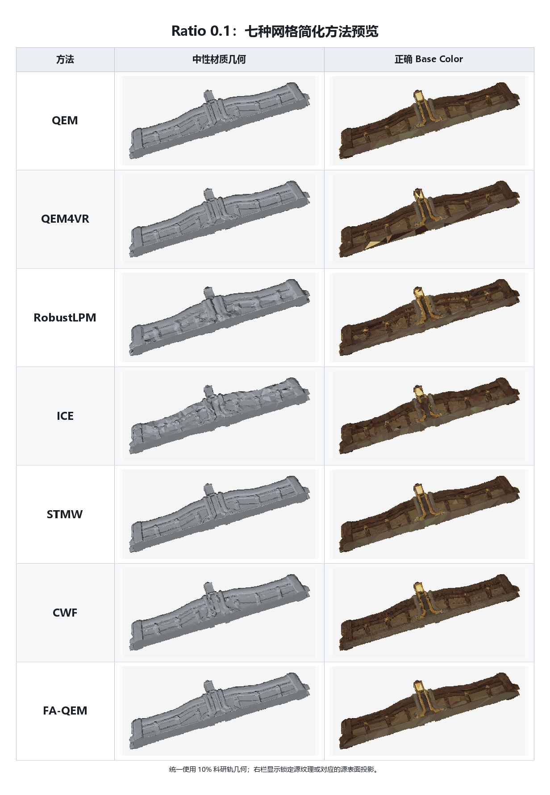

# Ratio 0.1：七种网格简化方法汇总

## 关键指标

| 方法 | 科研轨状态 | 实际面数 | 目标偏差 | H ↓ | C ↓ | Wall time (s) ↓ | 科研轨拓扑 | 资产轨状态 | RGB L2 ↓ |
|---|---|---:|---:|---:|---:|---:|---|---|---:|
| QEM | SUCCESS | 16,494 | 0.000% | 0.00506778 | 1.087e-08 | 8.59 | non-watertight; NM=4 | REPAIR_FAILED | — |
| QEM4VR | SUCCESS | 16,494 | 0.000% | 0.00125901 | 3.907e-08 | 11.73 | watertight | SUCCESS | **0.037928** |
| RobustLPM | SUCCESS | 16,494 | 0.000% | 0.01837818 | 8.440e-06 | 63.65 | watertight | SUCCESS | 0.052393 |
| ICE | SUCCESS | 16,502 | 0.049% | 0.01059898 | 1.700e-06 | **7.58** | non-watertight; NM=4 | REPAIR_FAILED | — |
| STMW | SUCCESS | 16,494 | 0.000% | **0.00061678** | **9.586e-09** | 20.31 | watertight | SUCCESS | 0.038596 |
| CWF | SUCCESS | 16,618 | 0.752% | 0.00675754 | 2.641e-07 | 5,695.53 | non-watertight; NM=233 | REPAIR_FAILED | — |
| FA-QEM | SUCCESS | 16,494 | 0.000% | 0.00150017 | 6.474e-08 | 18.05 | watertight | SUCCESS | 0.038501 |

指标口径：`H` 为单位包围盒对角线坐标下的双向 sampled Hausdorff；`C` 为 mean-squared symmetric Chamfer；几何指标和时间来自 10% 科研轨，RGB L2 来自对应的兼容资产轨。`—` 表示资产轨未通过硬门禁，因而没有可报告的纹理指标。数值越小越好。
