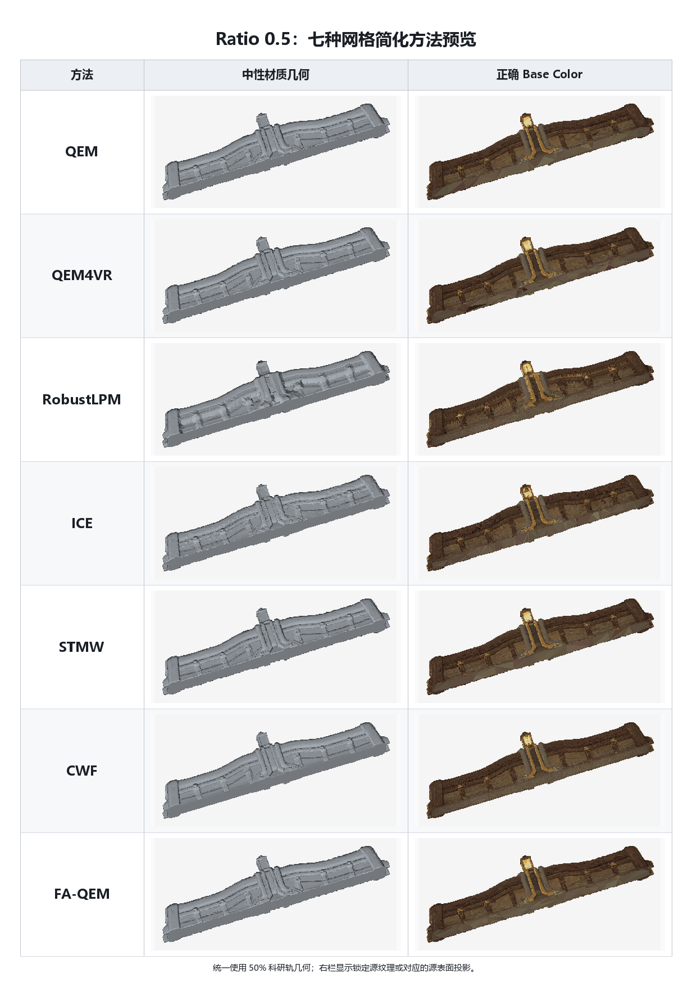

# Ratio 0.5：七种网格简化方法汇总

## 关键指标

| 方法 | 科研轨状态 | 实际面数 | 目标偏差 | H ↓ | C ↓ | Wall time (s) ↓ | 科研轨拓扑 | 资产轨状态 | RGB L2 ↓ |
|---|---|---:|---:|---:|---:|---:|---|---|---:|
| QEM | SUCCESS | 82,470 | 0.000% | 0.00422572 | 1.209e-09 | 36.44 | non-watertight; NM=1 | REPAIR_FAILED | — |
| QEM4VR | SUCCESS | 82,470 | 0.000% | **0.00022956** | 7.258e-10 | 8.13 | watertight | SUCCESS | 0.038234 |
| RobustLPM | SUCCESS | 82,470 | 0.000% | 0.01922080 | 7.965e-06 | 194.36 | watertight | SUCCESS | 0.051447 |
| ICE | SUCCESS | 82,478 | 0.010% | 0.00299278 | 6.482e-08 | **4.93** | watertight | SUCCESS | 0.038100 |
| STMW | SUCCESS | 82,470 | 0.000% | 0.00023497 | **4.106e-10** | 10.29 | watertight | SUCCESS | 0.037916 |
| CWF | SUCCESS | 82,507 | 0.045% | 0.00274322 | 1.501e-08 | 16,887.00 | non-watertight; NM=68 | REPAIR_FAILED | — |
| FA-QEM | SUCCESS | 82,470 | 0.000% | 0.00032294 | 2.020e-09 | 10.43 | watertight | SUCCESS | **0.037600** |

指标口径：`H` 为单位包围盒对角线坐标下的双向 sampled Hausdorff；`C` 为 mean-squared symmetric Chamfer；几何指标和时间来自 50% 科研轨，RGB L2 来自对应的兼容资产轨。`—` 表示资产轨未通过硬门禁，因而没有可报告的纹理指标。数值越小越好。
