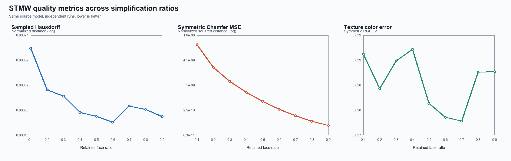

# STMW ratio sweep

Source model: `Test_Model/curved-lantern-balustrade-final.glb` (164,940 faces).
Each ratio is simplified independently from the same prepared source mesh.

| Ratio | Target faces | Actual faces | Hausdorff (normalized) | Chamfer MSE (normalized) | RGB L2 | Wall time (s) |
|---:|---:|---:|---:|---:|---:|---:|
| 0.1 | 16,494 | 16,494 | 6.167763e-04 | 9.585956e-09 | 0.038596 | 20.308 |
| 0.2 | 32,988 | 32,988 | 3.417340e-04 | 2.737691e-09 | 0.038119 | 13.903 |
| 0.3 | 49,482 | 49,482 | 3.129871e-04 | 1.254326e-09 | 0.038502 | 11.798 |
| 0.4 | 65,976 | 65,976 | 2.489234e-04 | 6.819599e-10 | 0.038664 | 9.732 |
| 0.5 | 82,470 | 82,470 | 2.349652e-04 | 4.105560e-10 | 0.037916 | 10.293 |
| 0.6 | 98,964 | 98,964 | 2.166308e-04 | 2.658723e-10 | 0.037725 | 6.681 |
| 0.7 | 115,458 | 115,458 | 2.719018e-04 | 1.860161e-10 | 0.037670 | 5.031 |
| 0.8 | 131,952 | 131,952 | 2.595319e-04 | 1.358182e-10 | 0.038347 | 3.608 |
| 0.9 | 148,446 | 148,446 | 2.343677e-04 | 1.079574e-10 | 0.038352 | 2.316 |

All geometry values use 100,000 area samples per direction; RGB L2 uses 10,000 samples per direction.
Lower is better for all three quality metrics.
